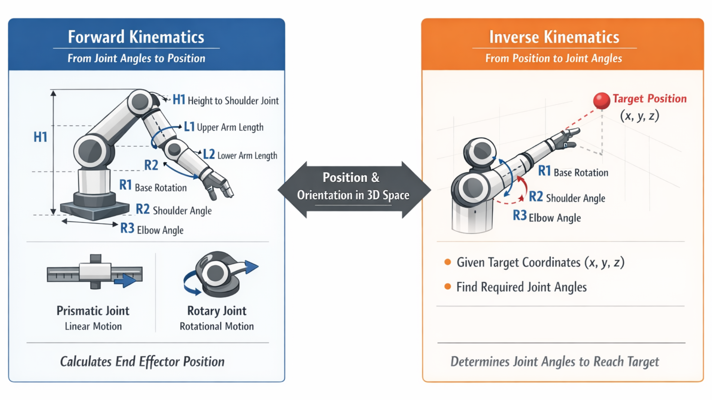

# Forward & Inverse Kinematics Documentation

## Overview
Kinematics is the branch of mechanics that studies the motion of robot's joints and links without considering the forces or torques that cause the motion. In robotic arm control, kinematics bridges the gap between the physical layout of the robot (joint angles) and the resulting position in 3D space. 

## Forward Kinematics
Forward Kinematics is the process of calculating the postion and orientation (pose) of the robot arm based on the given joint parameters.

- Prismatic joints (allows linear motion along a single axis)
- rotary joints (allows rotational motion)

### Function
The Forward Kinematics function calculates the robot arm's spatial coordinates and orientation. To simulate a real humanarm in 3D space, here is the anatomy (parameters) of our mathematical model:

- H1: Height from the floor to the shoulder joint
- L1: Length of the upper arm (bicep)
- L2: Length of the lower arm (forearm to the fingertips)
- R1: Base rotation (twisting the waist/shoulder left and right)
- R2: Shoulder pitch (raising the arm up and down)
- R3: Elbow pitch (bending the elbow) 

To find the 3D position (x,y,z) based on the three joint angles, we first calculate how far the arm reaches out horizontally (r), and then split that horizontal distance into x and y using the base rotation R1. It uses geometry and trignometry to find an exact mathematical solution. 

Horizontal Reach:

**r = L1cos(R2) + L2cos(R2+R3)**

**x = rcos(R1)**

**y = rsin(R1)**

**z (height) = H1 + L1sin(R2) + L2sin(R2+R3)**

## Inverse Kinematics
Inverse Kinematics is the reverse process. It's determining the specific joint angles required to position the robot armat a desired target in 3D space. Given the (x,y,z) coordinates, the inverse function calculates the necessary joint parameters. 

Multiple solutions: It can reach the same target in several ways (ex. reaching a point with an elbow up or elbow down configuration)

### Function
First, find the base rotation (R1) using (x,y) coordinate to point the torso at the target. 

**R1 = arctan2(y,x)**

Next, calculate the horizontal distance (r) to the target and adjust the target's height (z') relative to the shoulder joint.

**r = sqrt(x * x + y * y)**

**z' = z - H1**

Lastly, apply the Law of Cosine to get the elbow angle (R3)

**cos(R3) = (r * r + z' * z' - L1 * L1 - L2 * L2) / (2.0 * L1 * L2);**

Using R3, calculate the shoulder angle (R2) 

**double k1 = a2 + a3 * cos(R3);**
**double k2 = a3 * sin(R3);**
    
R2 = arctan2(z', r) - arctan2(k2, k1);
 
