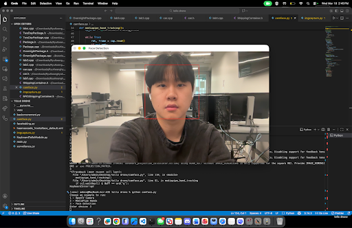
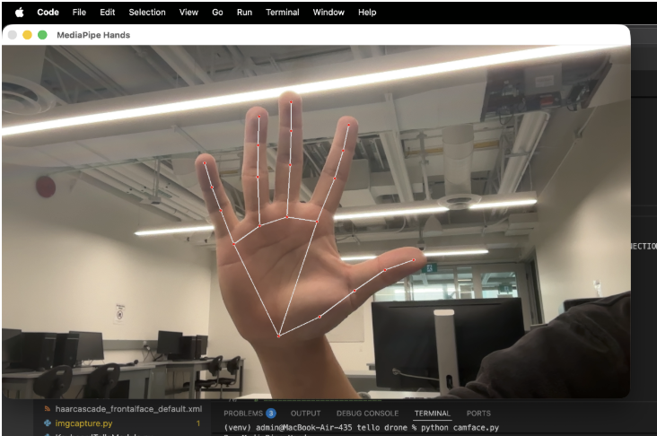

# Python, OpenCV, and MediaPipe Documentation


## Overview

Robot Arm project uses Python, OpenCV, and MediaPipe to implement real-time computer vision functionality. The system captures video input, processes image data, extracts structured features such as hand landmarks, and enables logic such as gesture interpretation.

The overall pipeline follows:

- Capture -> Preprocess -> Extract Features -> Apply Logic

## Python

Python acts as the primary language that integrates all components of the system. It manages execution flow, connects external libraries, and handles all application-level logic.

Relevant documentation:

- Python Official Docs: [https://docs.python.org/3/](https://docs.python.org/3/)
- NumPy (used for data processing): [https://numpy.org/doc/](https://numpy.org/doc/)

Python is used as the primary programming language for this project because it provides a balance between development speed, readability, and strong library support for computer vision and machine learning.

One of the main reasons for choosing Python is its integration with both OpenCV and MediaPipe. These libraries offer well-maintained Python APIs, allowing easy implementation of real-time vision pipelines without needing to build low-level components from scratch.

## OpenCV

OpenCV is used for image acquisition, preprocessing, and visualization. It acts as the interface between the camera hardware and the processing pipeline.

### Frame Capture

The camera is accessed using the `VideoCapture` API, which continuously retrieves frames from a video source.

```python
# Open the default webcam.
cap = cv2.VideoCapture(0)

# Read one frame from the camera.
ret, frame = cap.read()
```

Documentation:
[cv::VideoCapture Class Reference](https://docs.opencv.org/4.x/d8/dfe/classcv_1_1VideoCapture.html)

### Frame Preprocessing

Frames are typically transformed before being passed to other modules. A common step is horizontal flipping to provide a mirrored view.

```python
# Flip the frame horizontally so it behaves like a mirror.
frame = cv2.flip(frame, 1)
```

Documentation:
[OpenCV: Operations on arrays](https://docs.opencv.org/4.x/d2/de8/group__core__array.html#ga8c1f4a0c5d8f08e5e9c7a7e3a5f5b2a3)

Color conversion is required because OpenCV uses BGR format, while MediaPipe expects RGB.

```python
# Convert the frame from BGR to RGB for MediaPipe.
rgb = cv2.cvtColor(frame, cv2.COLOR_BGR2RGB)
```

Documentation:
[OpenCV: Color Space Conversions](https://docs.opencv.org/4.x/d8/d01/group__imgproc__color__conversions.html)

### Visualization

Processed frames can be displayed in real time for debugging and interaction.

```python
# Show the processed frame in a window.
cv2.imshow("Output", frame)

# Wait briefly so the window can refresh.
cv2.waitKey(1)
```

Documentation:
[High-level GUI](https://docs.opencv.org/4.x/d7/dfc/group__highgui.html)

### Classical Computer Vision

OpenCV also supports traditional computer vision algorithms such as Haar Cascade classifiers. In a previous project, this was used to detect and track faces.



```python
# Convert the image to grayscale before face detection.
imgGray = cv2.cvtColor(img, cv2.COLOR_BGR2GRAY)

# Detect faces at different scales in the grayscale image.
faces = faceCascade.detectMultiScale(imgGray, 1.2, 8)
```

## MediaPipe

MediaPipe is used for extracting high-level features using pre-trained machine learning models. It converts raw image data into structured representations such as landmarks.


### Hand Tracking Initialization

```python
# Import MediaPipe for hand landmark detection.
import mediapipe as mp

# Load the MediaPipe Hands solution.
mp_hands = mp.solutions.hands

# Initialize the hand tracker with detection settings.
hands = mp_hands.Hands(
    static_image_mode=False,
    max_num_hands=2,
    min_detection_confidence=0.7,
    min_tracking_confidence=0.5,
)
```

Documentation:
[Hand landmarks detection guide | Google AI Edge](https://ai.google.dev/edge/mediapipe/solutions/vision/hand_landmarker)

### Processing Frames

Each frame must be converted to RGB before being passed into MediaPipe.

```python
# Run hand landmark detection on an RGB frame.
results = hands.process(rgb_frame)
```

The output contains detected hands and their landmarks.

### Landmark Representation



Each detected hand consists of 21 landmarks. Every landmark includes:

- `x`: normalized horizontal position
- `y`: normalized vertical position
- `z`: relative depth

This structure allows the system to represent the hand as a compact feature vector instead of raw pixels.

### Example: Extracting Landmarks

```python
# Convert one detected hand into a flat list of x, y, z values.
def extract_landmarks_example(hand_landmarks):
    landmarks = []

    # Loop through all 21 landmarks on the hand.
    for landmark in hand_landmarks.landmark:
        # Store the normalized 3D coordinates.
        landmarks.extend([landmark.x, landmark.y, landmark.z])

    # Return the extracted landmark list.
    return landmarks
```

Documentation:
[Hand landmarks detection guide | Google AI Edge](https://ai.google.dev/edge/mediapipe/solutions/vision/hand_landmarker)

### Notes on Stability

- Use detection and tracking confidence thresholds appropriately
- Apply smoothing techniques (e.g., moving average) to reduce jitter
- Limit number of hands to reduce computation if needed

## Integration of OpenCV and MediaPipe

OpenCV and MediaPipe are combined into a continuous real-time pipeline. OpenCV handles frame capture and preprocessing, while MediaPipe extracts structured features.

```python
import cv2
import mediapipe as mp

# Load MediaPipe Hands and drawing utilities.
mp_hands = mp.solutions.hands
mp_drawing = mp.solutions.drawing_utils

# Open the default webcam.
cap = cv2.VideoCapture(0)

# Create the hand tracker once before the loop starts.
hands = mp_hands.Hands(
    static_image_mode=False,
    max_num_hands=2,
    min_detection_confidence=0.7,
    min_tracking_confidence=0.5,
)

# Keep reading frames until the user quits.
while cap.isOpened():
    # Read the next frame from OpenCV.
    ret, frame = cap.read()
    if not ret:
        # Stop if the camera frame could not be read.
        break

    # Flip the frame for a mirrored webcam view.
    frame = cv2.flip(frame, 1)

    # Convert the OpenCV frame from BGR to RGB.
    rgb_frame = cv2.cvtColor(frame, cv2.COLOR_BGR2RGB)

    # Send the RGB frame to MediaPipe for hand tracking.
    results = hands.process(rgb_frame)

    # If hands are detected, draw them and extract landmarks.
    if results.multi_hand_landmarks:
        for hand_landmarks in results.multi_hand_landmarks:
            # Draw the landmark connections on the frame.
            mp_drawing.draw_landmarks(
                frame,
                hand_landmarks,
                mp_hands.HAND_CONNECTIONS,
            )

            # Extract x, y, z values for each landmark.
            landmarks = []
            for landmark in hand_landmarks.landmark:
                landmarks.append((landmark.x, landmark.y, landmark.z))

            # Print the landmark list for debugging.
            print(landmarks)

    # Show the annotated frame in a window.
    cv2.imshow("Hand Tracking Output", frame)

    # Exit when the user presses q.
    if cv2.waitKey(1) & 0xFF == ord("q"):
        break

# Release the camera and close the OpenCV window.
cap.release()
cv2.destroyAllWindows()
```
