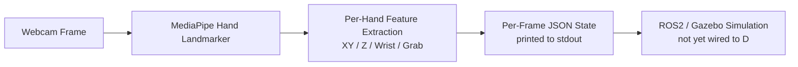
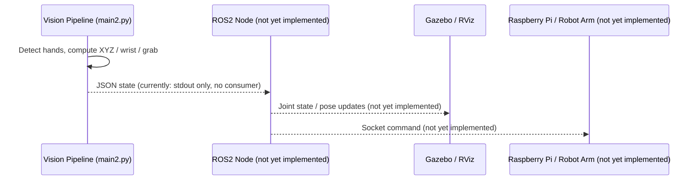

# Aether Software Architecture

This document describes how the Aether software stack works end-to-end: from
webcam input, through hand-tracking and gesture interpretation, to the
(currently simulated) robot arm. It is intended to let a new contributor
understand the system without reading the full source tree.

> Scope note: this document reflects the state of the `sfu-akcse/Aether`
> repository as inspected for issue
> [`sfu-akcse/Aether-docs#77`](https://github.com/sfu-akcse/Aether-docs/issues/77).
> Where a piece of the pipeline described in the project README (e.g.
> "socket communication to the Raspberry Pi") is not yet implemented in code,
> this is called out explicitly so the documentation does not overstate the
> current system.

---

## 1. High-Level Overview

Aether lets a user control a robot arm using only a laptop webcam — no
gloves, controllers, or extra sensors. The system is split into three
engineering domains (Software, Firmware, Mechatronics); this document covers
the **Software** stack, specifically the **Computer Vision Node**.

At a high level, data flows through four stages:



* **Stage A–B**: A camera frame is captured and run through Google
  MediaPipe's `HandLandmarker` to get 21 3D hand landmarks per detected hand.
* **Stage C**: Pure-Python geometry modules turn those landmarks into
  semantic features — hand position (X/Y), depth (Z), wrist tilt
  (roll/pitch), and an open/closed grab state.
* **Stage D**: Each frame's interpreted state is serialized to JSON and
  written to standard output (and to a rotating log file).
* **Stage E**: A ROS2-based Gazebo simulation exists for visualizing a robot
  arm model, but as of this writing it is **not yet subscribed to the
  vision pipeline's output** — see [Section 7](#7-ros2--simulation-architecture)
  for details.

---

## 2. Repository Map

| Path | Purpose |
|---|---|
| `src/main.py` | Single-hand vision pipeline (legacy/simple entry point). |
| `src/main2.py` | **Dual-hand** vision pipeline — right hand drives XYZ position, left hand drives grab + wrist + base rotation. This is the most complete pipeline. |
| `src/MultiHandTracker.py` | Tracks and "locks" left vs. right hand identity across frames. |
| `src/xy_coordinate.py` | Maps a hand's screen position to a normalized X/Y coordinate. |
| `src/z_coordinate.py` | Estimates depth (Z) from how large the hand's bounding box appears. |
| `src/base_rotation.py` | Derives a Left/Right "rotate the arm base" signal from X position, plus on-screen UI overlays. |
| `src/WristDetection.py` | Computes wrist roll (left/right tilt) and pitch (up/down) angles. |
| `src/GrabbingMotion.py`, `src/GrabbingMotion2.py` | Standalone grab-detection demos; `GrabbingMotion2.is_grabbing` is the version imported by `main2.py`. |
| `src/aether_logger.py` | Shared logger: writes to `logs/aether-system.log` and the console. |
| `scripts/host_webcam_stream.py`, `scripts/run_webcam_pipeline.sh` | Serve the host machine's webcam as an MJPEG HTTP stream so the vision code (which runs inside a dev container) can reach it. |
| `model/hand_landmarker.task` | The pretrained MediaPipe hand-landmark model file. |
| `model/robot_arm.urdf`, `model/robot_arm.sdf` | A minimal placeholder robot description (one revolute joint) used for Gazebo/RViz simulation. |
| `launch/robot_arm.launch.py`, `launch_gazebo.sh` | Bring up Ignition/Gazebo + RViz2 to visualize the arm model. |
| `ros2_ws/src/*` | ROS2 packages — currently the standard `py_pubsub`, `sample_topic`, `sample_srvcli`, and `sample_action_cpp` **tutorial scaffolding**. |

---

## 3. Camera Input & MediaPipe Processing Pipeline

### 3.1 Why two camera paths exist

Development happens inside a ROS2 dev container, but the container cannot
see the host machine's webcam directly. To work around this:

1. `scripts/host_webcam_stream.py` runs **on the host OS**, opens the local
   webcam with OpenCV, and serves it as an MJPEG stream
   (`http://localhost:8080/video.mjpg`).
2. Inside the dev container, `CAMERA_SOURCE` is set to that URL (or, on
   Linux with `/dev/video0` passed through, to a raw integer camera index).

### 3.2 Frame acquisition (`LatestFrameReader`)

Both `main.py` and `main2.py` define a `LatestFrameReader` class that runs
on a background thread and always exposes only the **most recent** frame
(never a queue), so the pipeline never processes stale frames:

* If `CAMERA_SOURCE` is an integer, it opens a local `cv2.VideoCapture` and
  sets `CAP_PROP_BUFFERSIZE = 1` to minimize internal buffering.
* If `CAMERA_SOURCE` is an `http(s)://` URL, it manually parses the raw
  MJPEG byte stream (looking for `0xFFD8`/`0xFFD9` JPEG start/end markers)
  instead of letting OpenCV decode the URL itself — this avoids a known
  buffering/black-frame issue with OpenCV's URL decoder.
* The reader auto-reconnects on stream errors and exposes
  `get_latest() -> (frame, timestamp)`.

The main loop also tracks **stream health**:
* If a frame is older than 1 second, it logs a "stream appears stale"
  warning (throttled).
* If incoming frames are near-black for 45 consecutive samples, it logs
  guidance to check the host preview page.

### 3.3 MediaPipe Hand Landmarker

Each frame is converted from BGR (OpenCV's native format) to RGB and wrapped
in an `mp.Image`, then passed to MediaPipe's Tasks API:

```python
options = vision.HandLandmarkerOptions(
    base_options=python.BaseOptions(model_asset_path=model_path),
    num_hands=2,
    min_hand_detection_confidence=0.5,
    min_hand_presence_confidence=0.5,
    min_tracking_confidence=0.5,
    running_mode=vision.RunningMode.VIDEO,
)
```

* `running_mode=VIDEO` requires a strictly increasing timestamp per call,
  which the pipeline derives from `time.monotonic()`.
* The model returns, per detected hand, 21 normalized landmarks (x, y in
  `[0,1]` relative to image size; z relative to the wrist) plus a
  `handedness` classification (`"Left"`/`"Right"`).
* For local webcams the frame is flipped horizontally (`cv2.flip(image, 1)`)
  to mirror it for the user; because MediaPipe sees the **pre-flip** image,
  downstream code must compensate when interpreting "Left"/"Right" (see
  §4 `MultiHandTracker`).

### 3.4 Multi-hand tracking & side-locking (`MultiHandTracker`)

MediaPipe's per-frame handedness label can flicker between frames. To
provide a stable identity for "the left hand" and "the right hand" across
the dual-hand pipeline (`main2.py`), `MultiHandTracker`:

1. Assigns each detection to a tracking "slot" by detection index.
2. Accumulates `SIDE_LOCK_FRAMES = 8` raw Left/Right guesses per slot before
   "locking" that slot to whichever side won the majority vote — after
   locking, the side never changes while the hand stays visible.
3. If `is_mirrored=True` (used for webcam input), it flips the raw
   MediaPipe label, since MediaPipe classifies on the un-mirrored image.
4. Ages a hand out after `HAND_DISAPPEAR_FRAME_THRESHOLD = 10` consecutive
   frames with no matching detection, releasing its side lock so a new hand
   can claim it later.

This gives the rest of the pipeline a simple API:
`tracker.get_hand(HandSide.RIGHT)` / `tracker.get_hand(HandSide.LEFT)`.

---

## 4. XYZ Coordinate Detection Logic

### 4.1 X/Y position (`xy_coordinate.py`, also reimplemented per-hand in `main2.py`)

1. A square region of interest is cropped from the center of the frame
   (`box_size = min(width, height)`), shown to the user as a red-tinted
   border via `border_box()` in `base_rotation.py`.
2. The hand's representative point is the **average position of seven
   palm/finger-base landmarks** (wrist, thumb CMC, and the four finger
   MCP joints), filtered to only those with valid `[0,1]` normalized
   coordinates.
3. That averaged pixel position is clamped to the square region, then
   rescaled to a **`-100` to `+100`** coordinate space on both axes:
   * `x = ((clamped_x - x1) / box_size) * 200 - 100`
   * `y = 100 - ((clamped_y - y1) / box_size) * 200` (note the Y axis is
     inverted so "up" on screen is positive, matching typical robotics
     convention.)

This `-100..100` range is intended to map directly onto the robot arm's
reachable workspace along its X/Y plane.

### 4.2 Z-depth estimation (`z_coordinate.py`)

There is no depth camera; Z is **inferred from apparent hand size**, on the
assumption that a hand appears larger as it moves closer to the camera:

1. A padded bounding box is computed around six palm landmarks.
2. `box_area = box_width * box_height`.
3. The user calibrates a "zero" depth by pressing **`r`**, which captures
   the current `box_area` as `base_value`.
4. On every subsequent frame:
   `z_offset = sqrt(box_area) - sqrt(base_value)`, floored at 0.

Using the square root of area (rather than raw area) makes the resulting Z
value scale roughly linearly with hand distance rather than quadratically,
since area scales with the square of linear size. The result is clamped to
be non-negative, so Z only increases as the hand moves *closer* than the
calibrated baseline (moving farther away reports `Z = 0` rather than a
negative value).

In `main2.py`, this Z estimation is applied specifically to the **right
hand**, which is dedicated to XYZ positional control; the left hand does
not produce a Z value.

---

## 5. Wrist Rotation Detection Logic (`WristDetection.py`)

Wrist orientation is derived from two independent angles computed from the
hand landmarks, each compared against a user-calibrated "base" pose
(captured by pressing **`b`**):

### 5.1 Roll (left/right tilt) — `compute_roll_degrees`

* Computed from the 2D vector from the wrist (landmark 0) to the middle
  finger's MCP joint (landmark 9), projected onto the image's X/Y plane:
  `atan2(delta_x, -delta_y)`.
* `0°` means the hand is upright; positive angles indicate a tilt to the
  user's right, negative to the left.
* The live roll is compared to the calibrated base roll. If the **delta**
  exceeds `LEFT_RIGHT_TILT_THRESHOLD_DEGREES = 12.0`, the hand is classified
  `"Left"` or `"Right"`; otherwise `"Center"`.

### 5.2 Pitch (up/down tilt) — `compute_palm_pitch_degrees`

* The palm center is approximated as the average of the four finger MCP
  joints (landmarks 5, 9, 13, 17).
* A `palm_axis` vector is formed from the wrist to that palm center.
* Only the **Y/Z** components of this vector are used (the X component is
  zeroed out) so the pitch measurement is insensitive to left/right roll
  and to finger spread during a grab.
* The angle is `atan2(z, -y)` of the normalized Y/Z vector.
* The live pitch is compared to the calibrated base pitch. If
  `abs(delta) >= UP_DOWN_DETECTION_THRESHOLD_DEGREES = 8.0`, the hand is
  classified `"Up"` or `"Down"` (sign of the delta determines direction);
  otherwise `"Neutral"`.

### 5.3 Calibration model

Both angles are **relative**, not absolute — the system has no fixed notion
of "neutral wrist angle" in the world. Instead, `calibrate_wrist_base()`
records the current roll/pitch as the zero-reference the first time (or
whenever) the user presses `b`. All later classifications are deltas
against that captured pose. In `main2.py`, this calibration is applied to
the **left hand**, alongside grab detection.

---

## 6. Grab Detection Logic (`GrabbingMotion.py` / `GrabbingMotion2.py`)

There are two implementations; `main2.py` imports `is_grabbing` from
**`GrabbingMotion2.py`**, which is the more robust, 3D-aware version.

### 6.1 `GrabbingMotion.py` (2D, simpler)

* Computes `hand_size` as the 2D distance from wrist to middle-finger MCP.
* For each of the four non-thumb fingertips (landmarks 8, 12, 16, 20),
  checks whether `distance(fingertip, wrist) / hand_size < 1.3`.
* Classifies as `"Grabbing"` if **4 of 4** fingertips are within that
  normalized distance of the wrist (i.e., fully curled).

### 6.2 `GrabbingMotion2.py` (3D, used in `main2.py`)

* Uses full 3D distance (`distance_3d`, including MediaPipe's relative `z`)
  instead of 2D screen distance, so a hand tilted in depth (wrist pitch)
  doesn't visually "shrink" in a way that falsely triggers a grab.
* For each finger, compares **fingertip-to-wrist** distance against
  **MCP-joint-to-wrist** distance (rather than a fixed threshold):
  a finger counts as curled if
  `tip_distance < mcp_distance + 0.55` (both normalized by hand size).
* Also checks thumb proximity: `thumb_to_index = distance_3d(thumb_tip, index_tip) / hand_size`.
* Classifies as `"Grabbing"` if **at least 3 of 4** fingers are curled
  **and** `thumb_to_index < 1.1`.

This version is intentionally more tolerant (3-of-4 fingers instead of
4-of-4, plus a thumb-proximity check) to reduce false negatives from
imperfect landmark tracking while still requiring thumb involvement to
avoid false positives from an open hand caught mid-motion.

---

## 7. ROS2 & Simulation Architecture

This is the area where the current implementation is **least complete**,
and the documentation calls that out explicitly rather than describing
aspirational behavior as if it exists.

### 7.1 What exists today

* **Vision pipeline output**: both `main.py` and `main2.py` end each frame
  by printing a JSON object to **stdout** (and only when the state changes,
  in `main.py`'s case) — e.g.:
  ```json
  {
    "left_hand": {
      "grab": "Grabbing",
      "wrist": {"up_down": "Up", "left_right_rotation": "Left"},
      "base_rotation": "Left"
    },
    "right_hand": {
      "xyz": {"pixel_x": 412, "pixel_y": 233, "x": 12.5, "y": -8.0, "z": 14},
      "base_rotation": "Center"
    }
  }
  ```
  There is **no ROS2 publisher, socket server, or other transport** in the
  vision pipeline code that consumes this JSON — it is currently only
  printed for terminal inspection / external piping.
* **ROS2 packages** (`ros2_ws/src/`): `py_pubsub`, `sample_topic`,
  `sample_srvcli`, and `sample_action_cpp` are the standard ROS2 tutorial
  packages (a minimal `String`-topic publisher/subscriber, a service/client
  pair, and an action server/client). They are scaffolding/learning
  examples, not Aether-specific nodes that consume hand-tracking data.
* **Simulation** (`launch/robot_arm.launch.py`, `launch_gazebo.sh`,
  `model/robot_arm.sdf`, `model/robot_arm.urdf`): brings up an Ignition
  Gazebo server with a placeholder arm model (one `revolute` `shoulder_joint`
  between a `base_link` and an `arm_link`), a `robot_state_publisher`, a
  `joint_state_publisher_gui` (manual slider control of joints, **not**
  driven by the vision pipeline), and RViz2 for visualization. This lets the
  team visualize and iterate on the robot model independent of the vision
  pipeline.

### 7.2 What is implied by the README but not yet implemented

The top-level README describes a third component, **"Socket
communication — real-time communication between the laptop and the
Raspberry Pi robot arm,"** but no socket client/server code was found in
the inspected source tree. This is presumably planned future work (likely
tracked by a separate issue/firmware repository) rather than something to
document as current behavior.

### 7.3 Implied / target message flow

Based on the shape of the existing pieces, the intended (not yet wired)
data flow is:



A future contributor implementing this bridge would need to: (1) create a
ROS2 node that reads the vision pipeline's JSON state (replacing the bare
`print()` calls with a proper publisher, or wrapping the pipeline as a ROS2
node directly), (2) map the right-hand XYZ and left-hand
grab/wrist/base-rotation signals onto the arm's joint space, and (3) publish
those joint states both to the Gazebo simulation and, eventually, to the
physical Raspberry Pi-driven arm over a socket connection.

---

## 8. Running the Pipeline (Reference)

For day-to-day setup, see the project `README.md`, summarized here:

1. **On the host OS**: `./scripts/run_webcam_pipeline.sh host --port 8080`
   (or `python3 scripts/host_webcam_stream.py --port 8080`) to serve the
   webcam as MJPEG.
2. **Inside the dev container**:
   `export CAMERA_SOURCE=http://host.docker.internal:8080/video.mjpg`
   then `python3 src/main2.py` (dual-hand) or `python3 src/main.py`
   (single-hand).
3. **Calibration keys** (when a window is shown, i.e. not headless):
   * `r` — set the right hand's current size as the Z = 0 baseline.
   * `b` — set the left hand's current wrist roll/pitch as the neutral base
     pose.
   * `Esc` — exit.
4. **Simulation** (separately, inside the dev container):
   `./launch_gazebo.sh` then `./scripts/run_gazebo_gui.sh` for a
   browser-based noVNC view of Gazebo.

Runtime logs are written to `logs/aether-system.log` via `aether_logger.py`
and mirrored to the console.

---

## 9. Suggested Follow-Up Documentation Issues

To fully satisfy the parent issue's checklist, the following are natural
splits for separate, focused PRs once this overview lands:

* A dedicated **ROS2 bridge design doc** once the stdout→ROS2 connector
  described in §7.3 is implemented, including actual topic/message
  definitions.
* A **calibration & tuning guide** documenting the meaning and effect of
  each threshold constant (`LEFT_RIGHT_TILT_THRESHOLD_DEGREES`,
  `UP_DOWN_DETECTION_THRESHOLD_DEGREES`, `SIDE_LOCK_FRAMES`,
  `HAND_DISAPPEAR_FRAME_THRESHOLD`, the `1.3` / `0.55` / `1.1` grab-detection
  ratios), since these are the main levers for tuning real-world
  responsiveness.
* An **architecture diagram set** (image assets) derived from the Mermaid
  diagrams in this document, for the published docs site.